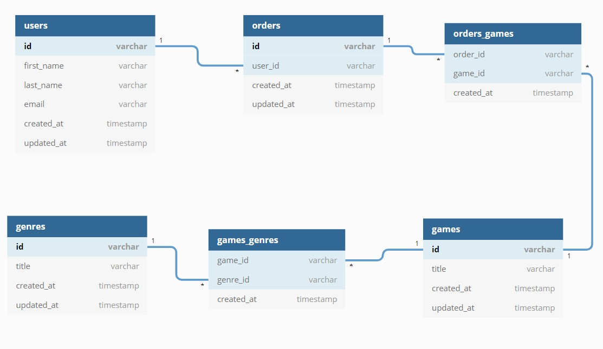

  <h1>
    ⚔ Desafio — Ignite 🔥
      
    Modelagem do banco de dados
  </h1>

  > Resolução do desafio **Database Modeling**, da trilha de NodeJS do bootcamp Ignite da Rocketseat.

___

  <strong>Ignite Bootcamp 🔥</strong>

